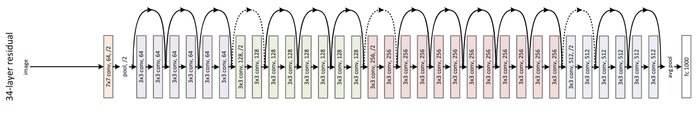

## Residual Networks (ResNet)
___

__ResNet__ is family of Convolutional Deep Neural Networks designed to solve Image Classification Problems. 
It consists of multiple _residual units_ (RU) with _shortcut connections_. 
Their goal is to address gradient vanishing problem and speed-up training procedure. 
Authors introduced 5 variants with 18, 34, 50, 101 and 152 layers.

#### Architecture

#### Residual unit

### Score table
___

|                | Cross Entropy Loss | Focal Loss |
|----------------|--------------------|------------|
| __ResNet-18__  | 51.4 %             | 51.4 %     |
| __ResNet-34__  | __58.9 %__         | 56.1 %     |
| __ResNet-50__  | 38.7 %             | 33.1 %     |
| __ResNet-101__ | 35.9 %             | 37.8 %     |
| __ResNet-152__ | 33.9 %             | 33.0 %     |

### References
___

[[1] Kaiming He, Xiangyu Zhang, Shaoqing Ren, Jian Sun: _Deep Residual Learning for Image Recognition_](https://arxiv.org/abs/1512.03385)
