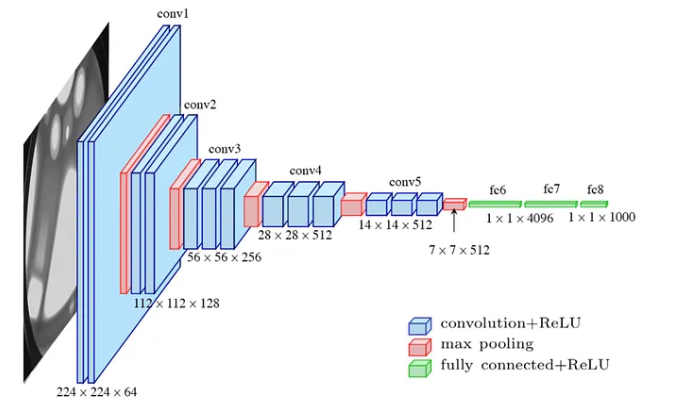

## Visual Geometry Group (VGG)
___

__VGG__ is family of Convolutional Deep Neural Networks designed to solve Image Classification Problems. 
It consists of 5 groups of Convolutional layers followed by 3 Dense Layers. 
Authors introduced 4 variants with 11, 13, 16 and 19 layers.

### Score table
___

|           | Cross Entropy Loss | Focal Loss |
|-----------|--------------------|------------|
| __VGG11__ | 10.8 %             | 7.6        |
| __VGG13__ | 10.9 %             | 12.5 %     |
| __VGG16__ | 10.0 %             | 11.4 %     |
| __VGG19__ | 4.0 %              | 2.4 %      |

### References
___

[[1] Karen Simonyan, Andrew Zisserman: _Very Deep Convolutional Networks for Large-Scale Image Recognition_](https://arxiv.org/abs/1409.1556)  
[[2] VGG-Net Architecture Explained](https://medium.com/@siddheshb008/vgg-net-architecture-explained-71179310050f)
